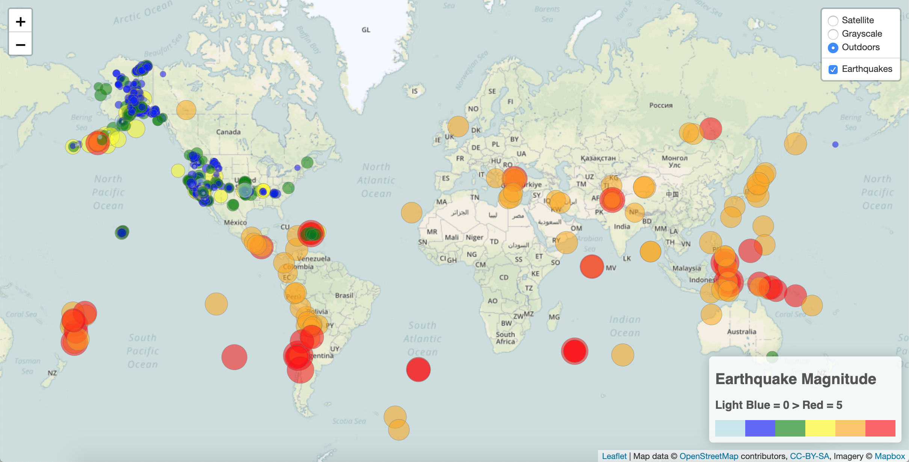
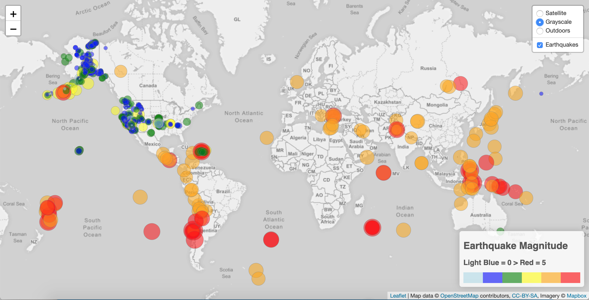
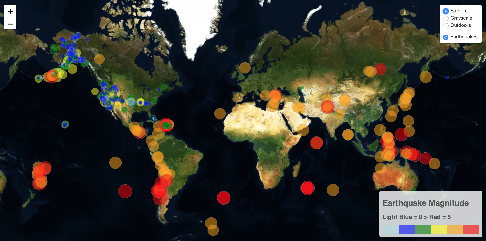

# Earthquake Mapping - Visualizing Data with Leaflet
## This project is hosted on GitHub Pages @ https://faedra.github.io/USGS-Earthquake-Mapping/

### Background:

The US Geological Survey is responsible for providing scientific data about natural hazards, the health of our ecosystems and environment; and the impacts of climate and land-use change. Their scientists develop new methods and tools to supply timely, relevant, and useful information about the Earth and its processes. 

For this project, I utilized a live datafeed from USGS to visualize earthquake data. To create the visualizetion, I imported the data from my datasource, and created a map that plots all of the earthquakes from that data set based on their longitude and latitude. I visualized the data using Leaflet.js, along with with OpenStreetMap geodata and Mapbox open source mapping platform for mapping support. 

### Data Source:
The dataset for this project is available via the USGS GeoJson feed, available at: http://earthquake.usgs.gov/earthquakes/feed/v1.0/geojson.php. 
The map data updates every 5 minutes, and is filtered to select worldwide earthquake events from the past 7 days. 

### Project Images:

Markers reflect the magnitude of the earthquake in their size and color. The live map includes popups that provide additional information about each earthquake when its marker is clicked, as well as a legend that provides context for the map data. The map also has controls for switching between street, grayscale, and satellite background imagery.

